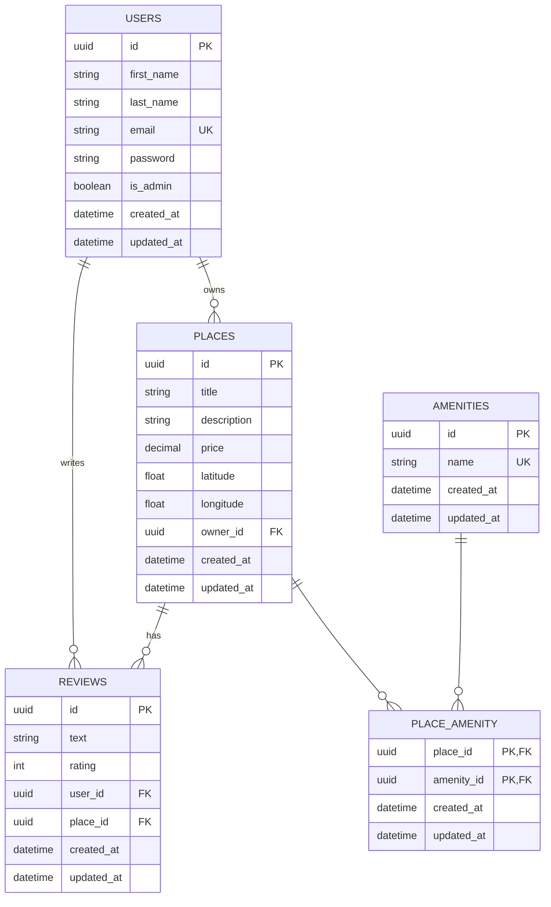
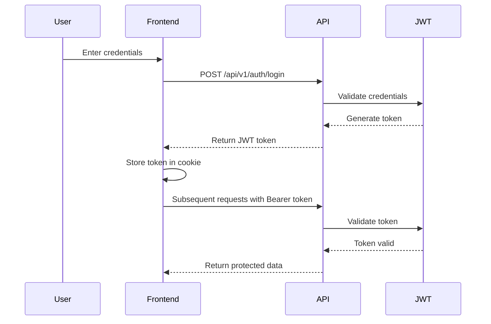

# 🏠 HBnB – Part 4: Web Interface with JWT Authentication

## 📋 Overview

This is Part 4 of the HBnB (Holberton Airbnb) project, featuring a complete web interface with JWT authentication, place browsing, detailed views, and review functionality. Users can authenticate, browse places, view detailed information, and add reviews through a modern web interface.

## 🚀 Features

### ✅ **Task 1: User Authentication**

- **Login System**: Secure JWT-based authentication
- **Session Management**: Automatic token handling and validation
- **Protected Routes**: Authentication required for certain features
- **Redirect Logic**: Automatic redirection based on auth status

### ✅ **Task 2: Places Listing & Filtering**

- **Dynamic Place Display**: Fetch and display all available places
- **Price Filter**: Filter places by maximum price
- **Interactive Cards**: Clickable place cards with details
- **Real-time Updates**: Dynamic content loading from API

### ✅ **Task 3: Place Details Page**

- **Comprehensive Information**: Display place title, description, price, host info
- **Amenities Display**: Show all available amenities
- **Reviews Section**: Display existing reviews with ratings
- **Star Rating System**: Visual 5-star rating display
- **Protected Access**: Authentication required to view details

### ✅ **Task 4: Add Review Functionality**

- **Review Form**: Interactive form with text and rating inputs
- **Validation**: Client-side and server-side input validation
- **Duplicate Prevention**: Prevent multiple reviews from same user
- **Owner Protection**: Prevent reviewing own places
- **Real-time Updates**: Immediate feedback and page refresh

## 🏗️ Project Structure

```
hbnb/
├── app/
│   ├── __init__.py                 # Flask application factory
│   ├── api/
│   │   ├── __init__.py
│   │   └── v1/
│   │       ├── __init__.py
│   │       ├── users.py            # User management endpoints
│   │       ├── places.py           # Places CRUD endpoints
│   │       ├── reviews.py          # Reviews CRUD endpoints
│   │       ├── amenities.py        # Amenities endpoints
│   │       ├── auth.py             # JWT authentication
│   │       └── protected.py        # Protected routes
│   ├── models/
│   │   ├── __init__.py
│   │   ├── user.py                 # User entity model
│   │   ├── place.py                # Place entity model
│   │   ├── review.py               # Review entity model
│   │   └── amenity.py              # Amenity entity model
│   ├── services/
│   │   ├── __init__.py
│   │   └── facade.py               # Business logic facade
│   └── persistence/
│       ├── __init__.py
│       └── repository.py           # Data persistence layer
├── templates/
│   ├── index.html                  # Places listing page
│   ├── login.html                  # Login page
│   ├── place.html                  # Place details page
│   └── add_review.html             # Add review page
├── static/
│   ├── styles.css                  # Application styles
│   ├── scripts.js                  # JavaScript functionality
│   └── images/
│       └── logo.png                # Application logo
├── config.py                       # Configuration settings
├── requirements.txt                # Python dependencies
├── run.py                          # Application entry point
└── README.md                       # This file
```

## 🔧 Technical Implementation

### **Frontend Technologies**

- **HTML5**: Semantic markup and structure
- **CSS3**: Modern styling and responsive design
- **Vanilla JavaScript**: Dynamic functionality and API interactions
- **Fetch API**: RESTful API communication
- **JWT Handling**: Token-based authentication

### **Backend Technologies**

- **Python 3.x**: Core programming language
- **Flask**: Web framework
- **Flask-RESTx**: API framework with Swagger documentation
- **Flask-JWT-Extended**: JWT authentication implementation
- **Repository Pattern**: Data access abstraction
- **Facade Pattern**: Business logic encapsulation

### **Key Features**

- **Responsive Design**: Mobile-friendly interface
- **Client-side Validation**: Form validation before submission
- **Error Handling**: Comprehensive error management
- **Security**: JWT token validation and protection
- **UX/UI**: Intuitive navigation and user feedback

## 🗄️ Database Schema



## ⚙️ Getting Started

### 🔹 **Prerequisites**

- Python 3.8 or higher
- pip (Python package installer)
- Virtual environment (recommended)

### 🔹 **Installation**

1. **Clone the repository**

```bash
git clone https://github.com/your-username/holbertonschool-hbnb.git
cd holbertonschool-hbnb/part4
```

2. **Create and activate virtual environment**

```bash
python3 -m venv venv
source venv/bin/activate  # On Windows: venv\Scripts\activate
```

3. **Install dependencies**

```bash
pip install -r requirements.txt
```

### 🔹 **Running the Application**

1. **Start the Flask server**

```bash
python run.py
```

2. **Access the application**

- **Web Interface**: [http://127.0.0.1:5000](http://127.0.0.1:5000)
- **API Documentation**: [http://127.0.0.1:5000/api_docs](http://127.0.0.1:5000/api_docs)

### 🔹 **Default Test Data**

The application comes with pre-populated test data:

- **Test Users**: Multiple users for testing authentication
- **Sample Places**: Various places with different attributes
- **Example Reviews**: Sample reviews to demonstrate functionality

## 🧪 Testing

### **Manual Testing Workflow**

1. **Authentication Test**

   - Visit `/login`
   - Use test credentials to log in
   - Verify JWT token storage and authentication

2. **Places Browsing Test**

   - Visit home page (`/`)
   - Browse available places
   - Test price filtering functionality

3. **Place Details Test**

   - Click "View Details" on any place
   - Verify place information display
   - Check reviews section

4. **Review Creation Test**
   - Navigate to place details (must be logged in)
   - Fill out review form
   - Submit and verify creation

### **API Testing**

Use the Swagger UI at `/api_docs` to test all endpoints:

- Authentication endpoints (`/api/v1/auth/`)
- Places endpoints (`/api/v1/places/`)
- Reviews endpoints (`/api/v1/reviews/`)
- User endpoints (`/api/v1/users/`)

## 🔐 Authentication Flow



## 📱 User Interface

### **Pages Overview**

- **Home (`/`)**: Place listings with search and filter
- **Login (`/login`)**: User authentication
- **Place Details (`/place`)**: Individual place information
- **Add Review (`/add_review`)**: Review submission form

### **Navigation Flow**

1. User visits home page
2. Logs in if not authenticated
3. Browses places and applies filters
4. Views place details
5. Adds reviews for places

## 🛡️ Security Features

- **JWT Authentication**: Secure token-based authentication
- **Input Validation**: Client and server-side validation
- **CORS Protection**: Cross-origin request handling
- **SQL Injection Prevention**: Parameterized queries
- **Rate Limiting**: API request throttling
- **Session Management**: Secure token handling

## 🚦 API Endpoints

### **Authentication**

- `POST /api/v1/auth/login` - User login
- `POST /api/v1/auth/logout` - User logout

### **Places**

- `GET /api/v1/places/` - List all places
- `GET /api/v1/places/{id}` - Get place details
- `POST /api/v1/places/` - Create place (protected)

### **Reviews**

- `GET /api/v1/reviews/places/{place_id}/reviews` - Get place reviews
- `POST /api/v1/reviews/places/{place_id}/reviews` - Create review (protected)

### **Users**

- `GET /api/v1/users/` - List users
- `POST /api/v1/users/` - Create user

## 🧑‍💻 Authors

- **Alexis Cornillon**


## 📚 References

- [Flask Documentation](https://flask.palletsprojects.com/)
- [Flask-RESTx Documentation](https://flask-restx.readthedocs.io/)
- [Flask-JWT-Extended](https://flask-jwt-extended.readthedocs.io/)
- [JavaScript Fetch API](https://developer.mozilla.org/en-US/docs/Web/API/Fetch_API)
- [JWT.io](https://jwt.io/) - JWT token debugging
- [Mermaid.js](https://mermaid-js.github.io/) - Diagram generation

## 📄 License

This project is part of the Holberton School curriculum and is for educational purposes only.

---

**🎉 Congratulations! You have successfully completed HBnB Part 4 with a fully functional web interface featuring authentication, place browsing, and review functionality!**
